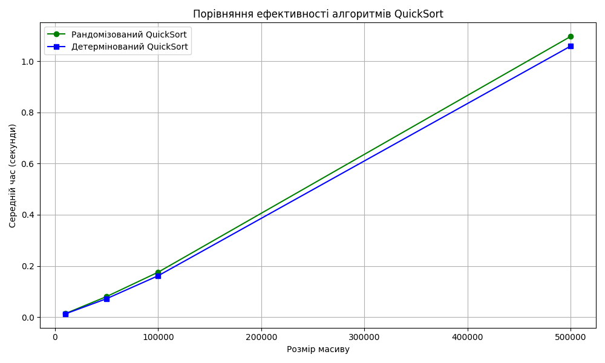

# goit-algo2-hw-10

Завдання 1 Порівняння рандомізованого та детермінованого QuickSort

## Опис завдання

Мета — реалізувати два варіанти алгоритму сортування QuickSort:
- **Рандомізований QuickSort** (`randomized_quick_sort`) — опорний елемент обирається випадковим чином.
- **Детермінований QuickSort** (`deterministic_quick_sort`) — опорний елемент фіксований (середній елемент).

Порівнюється середній час виконання кожного алгоритму на масивах розміру:
- 10 000
- 50 000
- 100 000
- 500 000 елементів

Кожне сортування виконується 5 разів для точності вимірювань.

## 📊 Результати

Розмір масиву: 10000
   Рандомізований QuickSort: 0.0139 секунд
   Детермінований QuickSort: 0.0128 секунд
Розмір масиву: 50000
   Рандомізований QuickSort: 0.0805 секунд
   Детермінований QuickSort: 0.0722 секунд
Розмір масиву: 100000
   Рандомізований QuickSort: 0.1757 секунд
   Детермінований QuickSort: 0.1617 секунд
Розмір масиву: 500000
   Рандомізований QuickSort: 1.0966 секунд
   Детермінований QuickSort: 1.0589 секунд

## Візуалізація

> Побудований графік порівнює середній час сортування в залежності від розміру масиву для обох алгоритмів.

## Висновок

- **Рандомізований QuickSort** показує дещо кращі результати на випадкових даних через уникнення найгірших випадків (O(n²)).
- **Детермінований QuickSort** стабільний, але чутливий до вибору опорного елемента.
- На практиці **рандомізований підхід рекомендується** при відсутності знань про вхідні дані.

Завдання 2 — Жадібний розклад занять

### Опис

Потрібно скласти розклад занять в університеті, використовуючи жадібний алгоритм для задачі **покриття множини**.

Мета — призначити **мінімальну кількість викладачів**, які сумарно покриють всі необхідні предмети:
- Математика
- Фізика
- Хімія
- Інформатика
- Біологія

### Вхідні дані

Маємо список викладачів з предметами, які вони можуть викладати, а також вік та email.

Пріоритет надається:
1. Тим, хто може викладати **більше предметів**, що ще не охоплені.
2. Якщо кілька кандидатів — **обирається наймолодший**.

### Результат роботи

Програма виводить розклад типу:

Розклад занять:
Наталія Шевченко, 29 років, email: n.shevchenko@example.com
   Викладає предмети: Біологія, Хімія

Дмитро Бондаренко, 35 років, email: d.bondarenko@example.com
   Викладає предмети: Інформатика, Фізика

Олександр Іваненко, 45 років, email: o.ivanenko@example.com
   Викладає предмети: Математика

### Обробка винятку

Якщо викладачів недостатньо для покриття всіх предметів, програма виведе:

Неможливо покрити всі предмети наявними викладачами.
